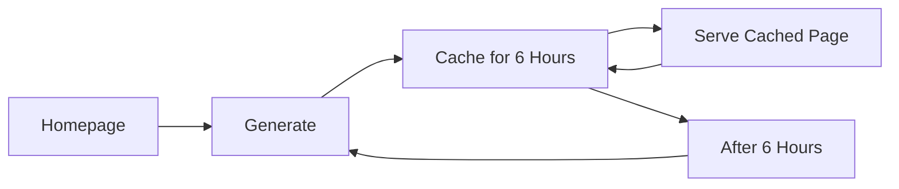

# Performance Optimization Report

## 1. Font Loading Optimization

### Problem

Currently, the application can load more font weights than are actually used.

### Solution

Define only the font weights that are used in the application.

```ts
const inter = Inter({
  variable: "--font-sans",
  subsets: ["latin"],
  weight: ["400", "500", "600", "700"],
});

const jetbrainsMono = JetBrains_Mono({
  variable: "--font-geist-mono",
  subsets: ["latin"],
  weight: ["400", "500"],
});
```

The exact weights should be based on their actual usage in the project.

### Benefit

Fewer font files will be loaded, which means **less data needs to be downloaded and the page can load faster**.

---

# Homepage ISR Revalidation Optimization

### Problem

Currently, the homepage is revalidated every **10 minutes**:

```ts
export const revalidate = 600;
```

This means the homepage can be regenerated approximately:

* **6 times per hour**
* **144 times per day**
* **4,320 times per 30-day month**

The application has only around **1 million server resources/invocations available per month**. Frequent homepage regeneration unnecessarily consumes a portion of these resources, leaving fewer resources available for other pages and application functionality.

### Solution

Change the revalidation time to **6 hours**:

```ts
export const revalidate = 21600;
```

This means the homepage will be regenerated approximately:

* **4 times per day**
* **120 times per 30-day month**

The homepage will remain **cached between regenerations**, so it does not need to be regenerated on every request.

The homepage should continue to show **today's top products** when available, while keeping the existing fallback to an available ranked product.

### Benefit



This reduces homepage regeneration from approximately **4,320 times/month to 120 times/month**, significantly reducing unnecessary resource consumption and leaving more resources available for the rest of the application.

---

# Proxy Authentication and Invocation Optimization

### Problem

Currently, the middleware runs on **almost every route** in the application.

Every time a user refreshes or requests a page, the middleware can be invoked. It also runs for routes that are public or may not even exist.

With only around **1 million invocations available per month**, unnecessary middleware executions can consume resources that could otherwise be used by the rest of the application.

For example:

```text
User refreshes public page

        ↓

Middleware runs

        ↓

Authentication / rate-limit processing

        ↓

Page loads
```

This processing is unnecessary for pages that do not require authentication.

### Solution

Run the middleware **only on routes that actually require authentication or protection**.

For example:

```text
Profile page

Production launch page

Admin page

Comment API

Rating API

        ↓

Middleware

        ↓

Authentication / protection
```

Public marketing pages should **not** go through the middleware:

```text
Home

Products

Collections

Blog

Terms

Privacy

Other public pages

        ↓

Page directly
```

### Benefit

The middleware will only run where it is actually required.

This will:

* Reduce unnecessary invocations.
* Save the monthly invocation limit.
* Prevent middleware from running on non-existent routes.
* Reduce authentication and rate-limit processing.
* Leave more resources available for the rest of the application.

**In short: instead of running middleware everywhere, run it only on protected pages and APIs that actually need it.**
